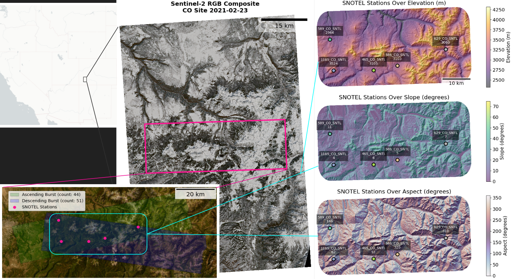
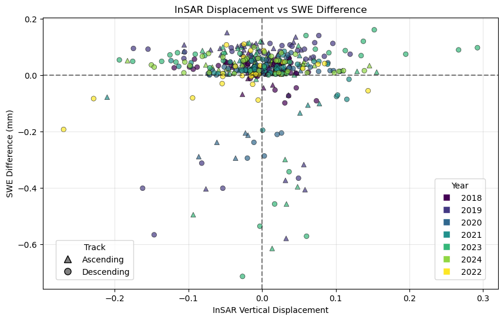
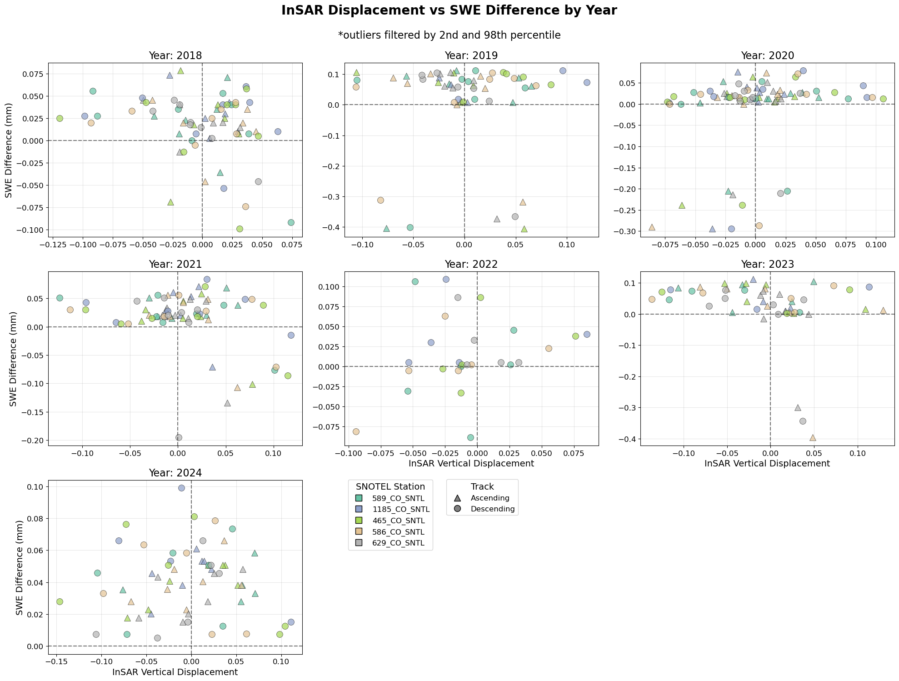
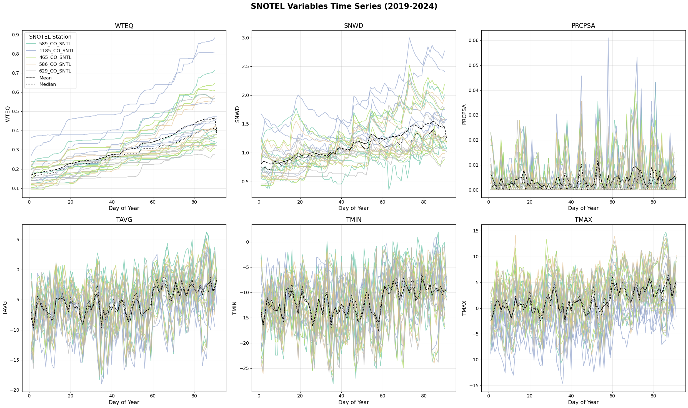
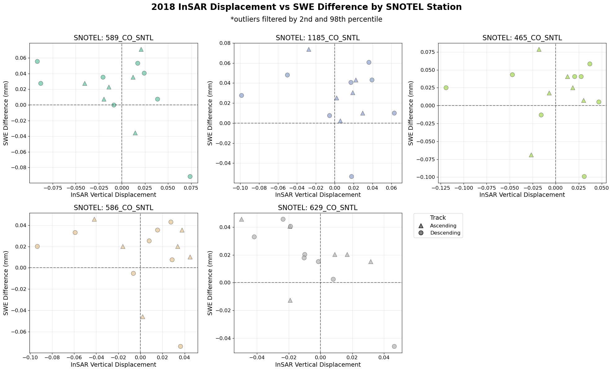
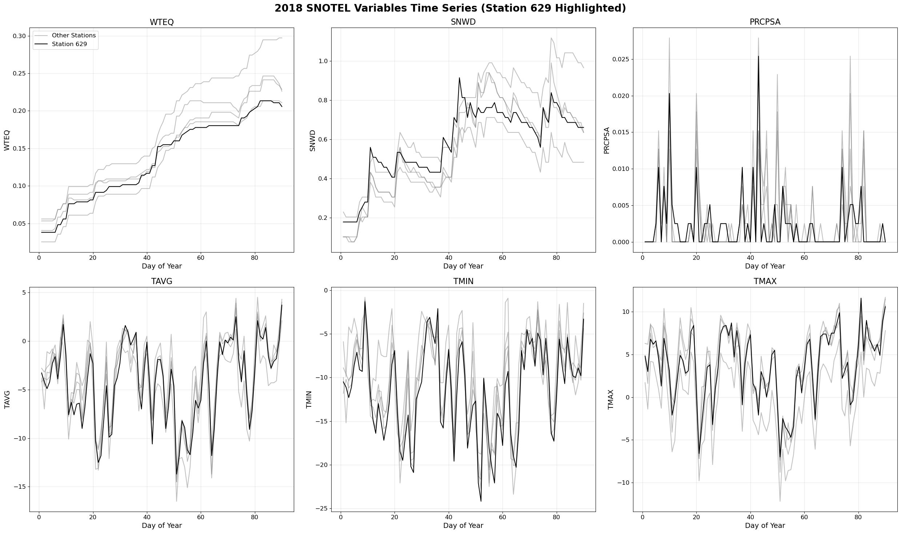

# Estimating Snow Water Equivalent using Spaceborne C‑Band InSAR  

Jack Hayes, Snow Hydrology Winter 2025: Final Writeup

---

## Abstract

Accurate estimation of snow water equivalent is critical for water resource management, flood mitigation, and agricultural planning in regions reliant on snowmelt runoff. Here, we explore the feasibility of using Sentinel‑1 C‑band InSAR to infer SWE changes in the San Juan National Forest, western Colorado. Although previous work (e.g., Tarricone et al., 2023) has demonstrated the effectiveness of airborne L‑band InSAR for snow monitoring, the inherent limitations of spaceborne C‑band radar in penetrating snow raise significant challenges. Building on foundational principles from *Introduction to Microwave Remote Sensing* by Iain Woodhouse regarding microwave-dielectric interactions in snow, we evaluate whether C‑band InSAR can yield meaningful SWE change estimates in regions with predominantly dry snowpack. Our analysis employs an FFT‑based phase unwrapping technique to derive surface displacements, which are then projected into vertical motion. This vertical motion between two time steps is compared against respective SWE differences measured from SNOTEL stations over the same time steps. The preliminary results indicate considerable uncertainties, highlighting the need for further refinement in methodology and data fusion with other sensors.

---

## 1. Introduction

### 1.1 Background

Estimating Snow Water Equivalent (SWE) is essential for water resource management, as it quantifies the water stored in snowpacks, which contributes to river flows and groundwater recharge upon melting. Accurate SWE measurements improve water availability forecasts, informing agricultural planning, hydroelectric power generation, and municipal water supplies (Barnett et al, 2005., Mote et al, 2005). Spaceborne remote sensing has the potential to provide extensive spatial coverage for accurate SWE estimation, enabling consistent monitoring of remote mountainous regions that are otherwise difficult to access with traditional snow surveying methods. Among remote sensing technologies, Synthetic Aperture Radar (SAR) is particularly useful for observing snow properties over large areas.

Traditionally, SAR backscatter techniques have been used to assess snow properties, particularly wetness, by detecting decreases in backscatter intensity as wet snow attenuates radar signals. However, estimating SWE using backscatter methods—especially at shorter wavelengths such as C-band—typically requires complex dense-media radiative transfer models. An alternative approach is Interferometric SAR (InSAR), which relates changes in interferometric phase to variations in SWE under dry snow conditions. By leveraging phase information from multiple SAR acquisitions, InSAR detects subtle surface displacements caused by snow accumulation or melt, offering a potentially more direct and less parameter-intensive means of SWE estimation. Although radiative transfer corrections in our dataset make backscatter analysis a viable option, we pursued InSAR processing to explore its potential for SWE retrieval (Truly, the products we're using provide enough radiative transfer correction and backscatter analysis would likely be better, but I wanted to learn InSAR processing).

The interaction of microwaves with snow is largely governed by the dielectric properties of the snowpack. According to Woodhouse in *Introduction to Microwave Remote Sensing*, the dielectric constant of snow depends on factors such as density, water content, and grain size. These properties determine the degree to which microwaves are absorbed or reflected, thereby influencing the InSAR signal. 

This project is based on Tarricone et al. (2023), which employed L‑band airborne InSAR to estimate snow accumulation and ablation. While L‑band radar can penetrate deeper into the snowpack and provide reliable information about its internal structure, C‑band radar is more sensitive to surface properties. This sensitivity, combined with the complexities of mountainous terrain, poses significant challenges for accurately estimating SWE using C‑band data.

Given the lack of availability of open-source L‑band satellite data, though, leveraging C‑band sensors like Sentinel‑1 becomes promising for snow hydrology research. Sentinel‑1’s free and widespread data acquisition allows researchers to continuously monitor large and remote mountainous regions, despite the inherent limitations in penetration depth and sensitivity compared to L‑band systems. Thus, even though C‑band is more surface-oriented and may struggle with capturing deeper snowpack properties, its accessibility makes it a valuable resource for developing and testing new SWE estimation methodologies in an operational setting.

### 1.2 Research Question

Given the technical constraints of C‑band spaceborne InSAR and the complex interaction of microwaves with snow, our study is guided by the following research question:

**Can Sentinel‑1 C‑band InSAR be effectively utilized to retrieve meaningful SWE change estimates in regions characterized by dry snowpack, despite its inherent limitations compared to L‑band systems?**

---

## 2. Methods

### 2.1 Data Acquisition and Preprocessing

The primary datasets used in this study are:
- **Sentinel‑1 C‑band Coregistered Single Look Complex (CSLC) Data:** These datasets provide the interferometric phase information necessary for vertical displacement analysis.
- **SNOTEL (SNOw TELemetry) SWE Measurements:** In-situ SWE data from SNOTEL stations stations are employed for validation of the derived displacement and SWE estimates.

The Sentinel-1 mission, operated by the European Space Agency, provides C-band SAR  data as Single Look Complex (SLC) products. These products contain both amplitude and phase information of the radar signal. The amplitude reflects the strength of the radar return, while the phase encodes the path length difference between the satellite and the ground, enabling detection of surface displacements. 

Sentinel-1 operates primarily in Interferometric Wide (IW) swath mode for land observations, scanning the radar beam across the swath in bursts. Unlike other modes, IW mode balances wide coverage with high resolution, making it ideal for InSAR. The SLC data offer a spatial resolution of approximately 5 meters in range (same direction as the sensor is pointing, perpendicular to the satellite flight track) and 20 meters in azimuth (same direction as satellite flight track). The satellites follow a near-polar, sun-synchronous orbit, acquiring data in ascending (northward) and descending (southward) passes. This dual-orbit configuration provides two viewing geometries of the same scene, and allows for a consistent revisit time of 6 days (12 days for ascending and 12 days for descending where the ascending and descending acquisitions are 6 days apart).

During ascending passes, Sentinel-1 moves from south to north and observes the target with a predominantly eastward line-of-sight (LOS), while during descending passes, it moves from north to south, viewing the area with a predominantly westward LOS. Although this affects the LOS displacement, our focus here is on the vertical displacement, making this orbit and LOS differentiation more relevant for interpreting plot symbology in future figures.

  

For this study, we utilized OPERA (Operational Performance of Earth Observation and Research Applications) CSLC products, which are derived from Sentinel-1 SLC data. OPERA CSLC products are different than standard SLCs because they're preprocessed with coregistration, corrections for orbital inaccuracies, topographic effects, and atmospheric delays, significantly enhancing their suitability for InSAR analysis. These products are stored in the Alaska Satellite Facility archives.

To balance computational efficiency with temporal coverage, we selected three-month periods (January to March) from 2018 to 2024, when snow is typically present, providing relevant data for SWE change estimation. The years were chosen to account for a sufficient sample size without having to process too much data. The date ranges were:

| Year | Start Date  | End Date    |
|------|-------------|-------------|
| 2018 | 2019-01-01  | 2018-03-31  |
| 2019 | 2019-01-01  | 2019-03-31  |
| 2020 | 2020-01-01  | 2020-03-31  |
| 2021 | 2021-01-01  | 2021-03-31  |
| 2022 | 2022-01-01  | 2022-03-31  |
| 2023 | 2023-01-01  | 2023-03-31  |
| 2024 | 2024-01-01  | 2024-03-31  |

This selection yielded 44 ascending and 51 descending bursts over the five-year period. With five SNOTEL sites per burst, this provided 220 SWE comparisons for ascending data and 255 for descending data, totaling 475 comparisons. For efficiency, only one ascending burst (T049_103322_IW2) and one descending burst (T129_275785_IW1) were processed per time period, as they adequately covered the study area and SNOTEL stations, minimizing data download and processing requirements.

The specific bursts were chosen because of their coverage of numerous SNOTEL sites. We manually inspected a map of SNOTEL station distribution, and selected the bursts as both the descending and ascending swath contained the same 5 SNOTEL sites. The Copernicus GLO-30 Digital Elevation Model (DEM) at 30m spatial resolution was brought in to assess potential bias resulting the terrain characteristics of the SNOTEL sites. We see that four out of five of the SNOTEL sites are at an elevation between 2950-3150 meters above the EGM2008 geoid. One of the stations is at an elevation of roughly 3500m. We see that all slopes are mild, between 4 and 11 degrees. The aspect of the sites are quite variable, but we don't believe this to be a major issue given the mild slopes.

Colorado is the site of interest due its predominantly dry snowpack that minimizes the complications associated with C‑band radar penetration as discussed earlier.

  

### 2.2 Theoretical Framework

The fundamental principle underlying InSAR is that the radar phase encodes the path length between the satellite and the ground surface. For a pair of SAR acquisitions, the observed phase is a combination of several contributions:

$$
\varphi = W \left( \varphi_{\text{topography}} + \varphi_{\text{deformation}} + \varphi_{\text{atmosphere}} + \varphi_{\text{orbit}} + \varphi_{\text{noise}} \right)
$$

Think of this as simply a measurement of distance, where we subtract these distances from two SAR acquisitions to understand how much the ground moves between each SAR acquisition in millimeter precision. The "ground moving" in our case is the "water level" of the snowpack. In a predominantly dry snowpack, minimal liquid water presence ensures that vertical displacement is largely governed by changes in the snow's density and volume, which directly relate to its water content. This close correspondence between vertical displacement and the effective "water level" makes InSAR a promising proxy for detecting subtle changes in SWE under dry conditions.

#### 2.2.1 Phase Contributions and Correction

The interferometric phase, as observed in our data, comprises multiple components. The most significant contributions include:

- **Topographic Phase $$\varphi_{\text{topography}}$$**  
  Variations in surface elevation cause differences in radar path lengths. This phase is approximated by:

$$ \varphi_{\text{topography}} = \frac{4\pi B h}{\lambda R \sin(\theta)} $$

  where:

  - $\lambda$ is the radar wavelength,
  - $B$ is the baseline (separation between acquisitions),
  - $h$ is the surface elevation,
  - $R$ is the radar line‑of‑sight distance,
  - $\theta$ is the incidence angle.

- **Atmospheric Phase $$\varphi_{\text{atmosphere}}$$**  
  Another significant source of error in InSAR measurements is the atmospheric phase delay. Atmospheric conditions (such as variations in temperature, pressure, and water vapor content) affect the propagation of radar waves, introducing phase delays that are unrelated to actual surface displacement. These effects are particularly pronounced in regions with strong weather variability or significant topographic relief.

  Correcting for atmospheric phase delays is essential to obtain accurate deformation measurements. This correction is typically accomplished by estimating the atmospheric contribution and subtracting it from the interferogram. Several approaches can be used to achieve this:

    1. Empirical Models: Statistical methods based on external weather data or empirical corrections derived from multiple interferograms can be used to estimate the atmospheric delay.
    2. Numerical Weather Models: High-resolution weather models, such as ECMWF ERA5 or NASA's MERRA-2, provide detailed estimates of atmospheric conditions at the time of radar acquisitions, allowing for more precise atmospheric delay corrections.
    3. GPS and Other Auxiliary Data: Integration of data from ground-based GPS stations and remote sensing sources (e.g., MODIS water vapor maps) further refines the atmospheric corrections by providing direct measurements of atmospheric water vapor content.

- **Orbital and Noise Phases $$\varphi_{\text{orbit}}$$ and $$\varphi_{\text{noise}}$$**  
  Although typically minor relative to the other terms, noise which arises due to the uncertainty in the satellite's position and motion during radar acquisition and random noise also contribute to the phase term.

The OPERA CSLC-S1 products are pre-flattened: they have been corrected for both the flat-Earth (ellipsoidal) and topographic phase using a reference Digital Elevation Model (DEM). Here, the Copernicus GLO-30 DEM. These products have also undergone "static troposphere" corrections to account for atmospheric phase errors (this is essentially a subtraction of atmospheric contributions from a physical model derived from numerical weather reanalysis data). Orbital and noise phase are also well accounted for in these products. 

#### 2.2.2 Phase Unwrapping and Displacement Calculation

Radar phase is inherently cyclical because it represents an angle that repeats every 2π radians. This is because we only actually know the position of the radar phase relative to the current cycle rather than the total number of cycles, which is challenging (so we only know the position along 0-2π of the current wavelength when the signal gets reflected back to the satellite, not the total number of cycles). Once the phase reaches +π, it wraps around to −π, meaning that any measured phase is only known modulo 2π. We wrap around −π to +π to discern positive vs negative displacements (surface displacement towards or away from the satellite sensor respectively). This property is a direct consequence of the sinusoidal nature of electromagnetic waves. In order to unwrap this phase data (essentially removing wrap operator $W$), a phase unwrapping technique is utilized. Phase unwrapping in itself is a large challenge, and algorithms to do so vary. However, we generally represent phase unwrapping as:

$$
\phi_{\text{unwrapped}}(i,j) = \phi_{\text{wrapped}}(i,j) + 2\pi \sum_{k=1}^{i} \sum_{l=1}^{j} \Delta\phi(k,l)
$$

where $\Delta\phi(k,l)$ represents the phase difference between adjacent pixels.

Conversion of the unwrapped phase to physical displacement is accomplished by the relationship:

$$
d = \Delta\phi \frac{\lambda}{4\pi}
$$

with $d$ representing the LOS displacement and $$\lambda$$ is the wavelength of the radar signal. LOS displacement represents the change in distance between the satellite and a target on the ground measured along the direction of the radar beam. This measurement captures any movement (vertical, horizontal, but almost always a combination thereof) and can be understood as a 2d vector.

A geometric projection is required to infer vertical (up/down) displacement:

$$
d_{\text{vertical}} = \frac{d_{\text{LOS}}}{\cos(\theta)}
$$

Where $$\theta$$ is the incidence angle, or the angle between the up/down direction and the radar wave at the surface.

#### 2.2.3 Microwave–Snow Interaction

The dielectric properties of snow play a crucial role in determining the radar signal response. Woodhouse’s *Introduction to Microwave Remote Sensing* explains that snow’s dielectric constant increases with water content, influencing both the attenuation and phase of the microwave signal. The sensitivity of C‑band radar to these changes is, however, worse compared to L‑band systems, which can penetrate deeper into the snowpack and provide more accurate SWE estimations.

The penetration depth of a radar signal is largely determined by the ratio of its wavelength to the size of the scatterers (or objects) within the medium. Longer radar wavelengths, such as those used in L‑band systems (around 24cm), are typically able to penetrate through media containing small scatterers (like snow grains) because their wavelength is significantly larger than the individual objects. In contrast, shorter wavelengths, like the 5.6cm of C‑band, are closer in size to the scatterers, which limits their ability to penetrate deeply into the medium. Though individual snow grains are much smaller in diameter than 5.6cm, snowpack microstructure (grain boundaries, layering, and potential stratification) can still induce multiple scattering events and phase distortions.

For Sentinel‑1, the interaction with a dry snowpack is dominated by surface scattering phenomena. Dry snow typically exhibits a low dielectric constant (on the order of 1.2–1.5) due to its high air content. Despite this, at a C-band wavelength, the radar signal’s penetration is constrained primarily to the uppermost layers of the snowpack. While snow grains do bond throughout the snowpack, the surface layer is subject to dynamic processes (wind redistribution, fresh snowfall, and rapid metamorphism) that promote the formation of larger, irregular aggregates. As these bonds between snow grains form at the surface, they act as more effective scatterers, increasing the surface roughness and thus disrupting penetration.

Because the electromagnetic radiation is primarily sensitive to the top few centimeters, there is a limitation in capturing the full vertical profile of the snowpack, potentially leading to underestimation of SWE when significant subsurface moisture gradients are present.

Additionally, as the snow begins to melt, even slight increases in liquid water content result in a marked increase in the dielectric constant, which in turn enhances signal attenuation and further alters the phase response. This transition from dry to wet snow introduces complexities in isolating the contribution from surface displacement related solely to SWE.

Understanding these interactions is critical for calibrating our InSAR-derived displacement measurements to SWE. The challenge lies in disentangling the contributions of surface roughness, snow layering, and melt-induced changes from the true deformation signal. Future work may benefit from coupling C‑band measurements with auxiliary data or adopting multi-frequency approaches to better characterize the full snowpack structure.

*Section based on (Woodhouse, I. H., Introduction to Microwave Remote Sensing., UW Mountain Hydrology Research course materials from CEWA 568)

### 2.3 Data Analysis Techniques

Sentinel-1 CSLC data are downloaded using the `asf_search` Python package, interfacing with the Alaska Satellite Facility’s archive. Bursts were retrieved for the specified date ranges and burst IDs and stored in separate directories for each orbit direction. For each consecutive pair of acquisitions, interferograms are formed by multiplying the complex SLC data of the reference scene by the conjugate of the secondary scene to produce a wrapped phase interferogram. The phase angle, representing the interferometric phase difference influenced by surface displacements, is extracted. OPERA CSLC products are already corrected for topography, atmospheric, orbital, and noise-induced phase, allowing focus on displacement-related phase changes.

The coordinate reference system (CRS) is also extracted from the CSLC metadata (which was always EPSG:32612 for this region). SNOTEL station coordinates, accessed via the `easysnowdata` package, are reprojected to match this CRS, ensuring accurate spatial alignment with the InSAR data.

The wrapped phase (ranging from -π to π) is unwrapped using a custom algorithm. This algorithm is NumPy native, and was developed to integrate efficiently with our Xarray-based workflow as most unwrapping softwares are clunky, introduce software environment issues, and require a longer runtime. This Fast Fourier Transform (FFT) least-squares approach computes finite differences of the wrapped phase, constructs the divergence, and solves the Poisson equation via FFTs to yield a continuous phase field. Though fast and NumPy-native, this algorithm is less robust than commonly used phase unwrapping algorithms in terms of accounting for error propagation in the phase field.

The unwrapped phase was then converted to LOS displacement using the formula where $$\lambda \approx 0.056 \text{ m}$$ (Sentinel-1 wavelength, where the OPERA CSLC metadata provides a more-precise wavelength than the commonly rounded 0.056m which we used). The LOS displacement was projected to vertical displacement with an incidence angle  $$\theta = 35^\circ.$$

An incidence angle of 35 was chosen as this number is commonly used for Sentinel-1 if you don't have access to the precise local incidence angle. This local incidence angle is available in the OPERA CSLC-S1 Static products but not the OPERA CSLC-S1 products that we are using—an oversight on my part; this approximation may introduce bias. Variations in the actual local incidence angle can affect the cosine projection, potentially altering the vertical displacement estimates.

SWE data from the five SNOTEL stations are retrieved, and differences in SWE between reference and secondary dates are calculated for each interferometric pair (InSAR vertical displacement from timestep 1 to timestep 2 vs SWE timestamp 2 minus timestamp 1, where timestep 1 and 2 are always 12 days apart). InSAR-derived vertical displacements are interpolated to SNOTEL locations via a spatial intersection since the SNOTEL geometries are represented by point geometries rather than their 3x3m snow pillow polygons. This spatial resolution mismatch between InSAR data (5 m × 20 m) and SNOTEL snow pillows, or rather centroids of snow pillows, should be noted.

---

## 3. Results

The initial analysis of the scatter plot comparing InSAR-derived vertical displacement and SWE differences (both computed as the change over a 12-day period) reveals a highly scattered distribution with no obvious relationship when all years were combined. 

  

To reduce the noise and increase interpretability, outliers are removed using the 2nd and 98th percentile thresholds where the percentiles are calculated on the data aggregated for all years. This filtering notably eliminated all ascending burst points for 2022. Subsequent separation into yearly scatter plots showed that, while most years continued to exhibit noisy patterns, the 2018 data presented a slight indication of a more coherent trend.

  

In parallel, a series of line plots are generated for SNOTEL variables (SWE, snow depth, precipitation, average temperature, minimum temperature, and maximum temperature) with the day-of-year (January 1 to March 31) as the common x-axis. Each subplot displays different colored lines for each station, with each station having seven distinct lines representing the years 2018 through 2024, overlaid by the mean and median values of all lines. These plots reveal that all variables follow a broadly similar seasonal pattern, albeit with varying magnitudes. Notably, the precipitation data exhibits significant station-dependent variability, highlighting an aspect that warrants further analysis.

  

* note that the title (2019-2024) is a typo, and the data from 2018 is in fact included

Given the inconclusive trends in the multi-year scatter plots, the focus is narrowed to the year 2018 as this year shows hints of a potential relationship. Here, SWE differences versus InSAR vertical displacement are plotted separately for each SNOTEL station. Although the majority of the data remains noisy, the descending burst measurements for station 629 show a subtle negative linear relationship between InSAR vertical displacement and SWE difference. This observation is confusing since we expect a positive relationship between vertical displacement and SWE content, as when there is more water in the snow pack, we expect the vertical displacement of the radar signal to be positive as the "water level" of the snowpack should be higher in timestep 2 vs timestep 1. Such an anomaly merits further investigation.

  

Finally, a dedicated line plot for 2018 is created to compare the SNOTEL variables with station 629 highlighted in black against grayed-out lines for the remaining stations. It should be noted that station 629 shares similar elevation and terrain characteristics to the other stations. This plot reaffirmed that, aside from differences in precipitation magnitude, there are no striking differences in the trends across the variables. Without a more detailed analysis, these results remain preliminary and call for a deeper dive into the anomalous behavior observed at station 629.

  

---

## 4. Discussion

Enhanced Modeling could specifically benefit not only from the integration of additional variables (e.g., temperature gradients and density profiles) but also from re-evaluating the reliability of ground truth measurements. Although SNOTEL stations provide valuable SWE data, their readings may be compromised by site-specific microclimatic effects and sensor limitations, resulting in data that do not always represent broader snowpack conditions. Alternative data sources—such as the better calibrated station measurements available at Kettle Ponds from the "Sublimation of Snow" mission efforts, combined with physical snow survey data—could decrease uncertainty by providing detailed insights into snowpack morphology and wind-driven effects.

In addition to refining the modeling approach, the sampling methodology warrants improvement to better capture the spatial heterogeneity of dry snowpack environments. Currently, the study relies on a limited number of sites that may not adequately represent regional variability. Expanding the dataset to include a larger number of dry snowpack sites would provide a more comprehensive evaluation of the InSAR technique under diverse conditions. Furthermore, conducting a robust spatial autocorrelation analysis would enable the identification of patterns and clusters within the data, revealing potential biases in sensor placement and measurement variability. This analysis would inform uncertainty of the overall SWE change estimation framework.

Furthermore, an inherent limitation of converting LOS displacement to vertical displacement is that it assumes negligible horizontal motion. In dynamic environments such as mountainous snowy regions, wind-driven processes and complex slope dynamics can induce significant lateral movements that are not captured by a purely vertical analysis. Additionally, measurement errors may arise from radar-specific geometric distortions—namely shadowing, foreshortening, and layover. Localized patterns of high elevation relief and abrupt topographic variations can exacerbate these issues, potentially introducing discrepancies in the InSAR-derived displacement estimates despite the rigorous corrections applied to the CSLC products.

Lastly, our processing methodology relies on a custom FFT‑based least‑squares phase unwrapping algorithm that has not yet undergone thorough validation. This method computes phase gradients from the wrapped phase data and “wraps” these differences back into the [–π, π] interval. It then builds a divergence field from these wrapped gradients and solves the corresponding Poisson equation using FFT to obtain a globally integrated, unwrapped phase field in one deterministic step. Although this approach is computationally efficient, simple to implement with NumPy arrays, and deterministic, it lacks additional robustness measures to counteract phase discontinuities or the influence of noise. In contrast, well‐established algorithms such as SNAPHU (Statistical-cost, Network‑flow Algorithm for Phase Unwrapping) adopt an iterative, cost-minimization framework—often formulated as a maximum a posteriori probability problem—where quality maps are generated to distinguish reliable from unreliable pixels (Costantini, 1998). SNAPHU then employs network-flow optimization and branch-cut methods to “stitch” the phase data together while minimizing error propagation across discontinuities. Such robust techniques, although more computationally intensive, are critical for achieving the high precision necessary in snow hydrology applications where even minor unwrapping errors can lead to significant distortions in displacement (like SWE estimates).

---

## 5. Conclusions

This study demonstrates that while Sentinel‑1 C‑band InSAR provides a cost‑effective and frequently updated data source, its use for accurate SWE change estimation is challenged by several factors:

- **Limited Penetration Depth:** The shorter wavelength restricts radar penetration, reducing sensitivity to subsurface moisture variations.
- **Complex Terrain Effects:** Although the SNOTEL stations are on gentle slopes, surrounding high-relief features can induce foreshortening, layover, and shadowing that complicate displacement measurements.
- **Geometric Projection Assumptions:** Converting LOS to vertical displacement assumes negligible horizontal motion—a simplification that may not hold in dynamic snowpack environments, particularly during wind-driven events.

In comparison, L‑band systems (as employed by Tarricone et al., 2023) offer better penetration and sensitivity to internal snowpack properties, underscoring the trade-offs between radar frequency, spatial resolution, and penetration depth in snow hydrology applications.

Future work should explore the use of longer wavelength data (like the upcoming NISAR mission) and integrate InSAR with physical snowpack models that incorporate additional variables like temperature gradients and density profiles. Further refinement of phase unwrapping techniques and enhanced sampling methods (including a broader range of sites and spatial autocorrelation analyses) will be critical to capturing the spatial heterogeneity of snow-covered regions and reducing uncertainties in SWE change estimation.

Overall, while C‑band InSAR holds promise, its current limitations highlight the need for improved methodologies and multi‑frequency approaches to advance the reliability of snow hydrology assessments.

---

## References

1. **Woodhouse, I. H.** *Introduction to Microwave Remote Sensing*. This text provides a fundamental understanding of microwave interactions with natural surfaces, including the dielectric properties of snow.
2. **Tarricone, J., Webb, R. W., Marshall, H.-P., Nolin, A. W., & Meyer, F. J.** (2023). Estimating snow accumulation and ablation with L‑band interferometric synthetic aperture radar (InSAR). *The Cryosphere, 17*(1997-2023).
3. **Ferretti, A., Prati, C., & Rocca, F.** (2001). InSAR processing: Techniques and challenges in phase unwrapping and correction. *IEEE Transactions on Geoscience and Remote Sensing*.
4. **Costantini, M.** (1998). 2-D phase unwrapping algorithm based on network programming. *Journal of Applied Geophysics, 40*(1-2), 24–36. 
5. **Barnett, T. P., Adam, J. C., & Lettenmaier, D. P.** (2005). Potential impacts of a warming climate on water availability in snow-dominated regions. *Nature, 438*(7066), 303–309.  
6. **Mote, P. W., Hamlet, A. F., Clark, M. P., Lettenmaier, D. P., & Miller, J.** (2005). Declining mountain snowpack in western North America. *Bulletin of the American Meteorological Society, 86*(1), 39–49.  
7. **UW Mountain Hydrology Research Course Materials, CEWA 568.** (2025). University of Washington, Department of Civil and Environmental Engineering.
