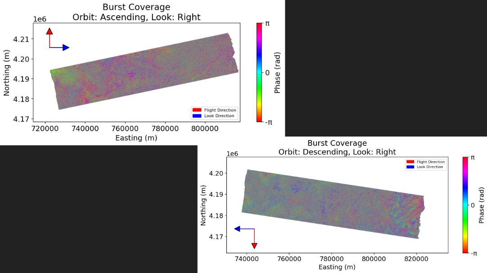

# Estimating Snow Water Equivalent using Sentinel‑1 C‑Band InSAR  

Jack Hayes, Snow Hydrology Winter 2025: Final Writeup

---

## Abstract

Accurate estimation of snow water equivalent (SWE) is critical for water resource management, flood mitigation, and agricultural planning in regions reliant on snowmelt runoff. Here, we explore the feasibility of using Sentinel‑1 C‑band Interferometric Synthetic Aperture Radar (InSAR) to infer SWE in the San Juan National Forest, western Colorado. Although previous work (e.g., Tarricone et al., 2023) has demonstrated the effectiveness of L‑band InSAR for snow monitoring, the inherent limitations of C‑band radar in penetrating snow raise significant challenges. Building on foundational principles from *Introduction to Microwave Remote Sensing* (Woodhouse) regarding microwave–dielectric interactions in snow, we evaluate whether C‑band InSAR can yield meaningful SWE estimates in regions with predominantly dry snowpack. Our analysis incorporates corrections for topographic, atmospheric, orbital, and noise contributions to the radar phase and employs FFT‑based phase unwrapping techniques to derive surface displacements, which are then projected into vertical motion. The preliminary results indicate considerable uncertainties, highlighting the need for further refinement in methodology and data fusion with other sensors.

---

## 1. Introduction

### 1.1 Background

Estimating Snow Water Equivalent (SWE) is essential for water resource management, as it quantifies the water stored in snowpacks, which contributes to river flows and groundwater recharge upon melting. Accurate SWE measurements improve water availability forecasts, informing agricultural planning, hydroelectric power generation, and municipal water supplies. Spaceborne remote sensing has the potential to provide extensive spatial coverage for accurate SWE estimation, enabling consistent monitoring of remote mountainous regions that are otherwise difficult to access. Among remote sensing technologies, Synthetic Aperture Radar (SAR) is particularly useful for observing snow properties over large areas.

Traditionally, SAR backscatter techniques have been used to assess snow properties, particularly wetness, by detecting decreases in backscatter intensity as wet snow attenuates radar signals. However, estimating SWE using backscatter methods—especially at shorter wavelengths such as C-band—typically requires complex dense-media radiative transfer models. An alternative approach is Interferometric SAR (InSAR), which relates changes in interferometric phase to variations in SWE under dry snow conditions. By leveraging phase information from multiple SAR acquisitions, InSAR detects subtle surface displacements caused by snow accumulation or melt, offering a potentially more direct and less parameter-intensive means of SWE estimation. Although radiative transfer corrections in our dataset make backscatter analysis a viable option, we pursued InSAR processing to explore its potential for SWE retrieval (Truly, the products we're using provide enough radiative transfer correction and backscatter analysis would likely be better, but I wanted to learn InSAR processing).

The interaction of microwaves with snow is largely governed by the dielectric properties of the snowpack. According to Woodhouse in *Introduction to Microwave Remote Sensing*, the dielectric constant of snow depends on factors such as density, water content, and grain size. These properties determine the degree to which microwaves are absorbed or reflected, thereby influencing the InSAR signal. While L‑band radar can penetrate deeper into the snowpack and provide reliable information about its internal structure, C‑band radar is more sensitive to surface properties. This sensitivity, combined with the complexities of mountainous terrain, poses significant challenges for accurately estimating SWE using C‑band data.

Given the limited availability of open-source L‑band satellite data, though, leveraging C‑band sensors like Sentinel‑1 becomes promising for snow hydrology research. Sentinel‑1’s free and widespread data acquisition allows researchers to continuously monitor large and remote mountainous regions, despite the inherent limitations in penetration depth and sensitivity compared to L‑band systems. Thus, even though C‑band is more surface-oriented and may struggle with capturing deeper snowpack properties, its accessibility makes it a valuable resource for developing and testing new SWE estimation methodologies in an operational setting.

### 1.2 Research Question

Given the technical constraints of C‑band spaceborne InSAR and the complex interaction of microwaves with snow, our study is guided by the following research question:

**Can Sentinel‑1 C‑band InSAR be effectively utilized to retrieve meaningful SWE estimates in regions characterized by dry snowpack, despite its inherent limitations compared to L‑band systems?**

---

## 2. Methods

### 2.1 Data Acquisition and Preprocessing

The primary datasets used in this study are:
- **Sentinel‑1 C‑band CSLC Data:** Acquired over the San Juan National Forest, these datasets provide the interferometric phase information necessary for surface displacement analysis.
- **SNOTEL SWE Measurements:** Ground‐truth SWE data from SNOTEL stations are employed for validation of the derived displacement and SWE estimates.

The Sentinel-1 mission, operated by the European Space Agency (ESA), provides C-band SAR  data as Single Look Complex (SLC) products. These products contain both amplitude and phase information of the radar signal. The amplitude reflects the strength of the radar return, while the phase encodes the path length difference between the satellite and the ground, enabling detection of surface displacements. 

Sentinel-1 operates primarily in Interferometric Wide (IW) swath mode for land observations, scanning the radar beam across the swath in bursts. Unlike other modes, IW mode balances wide coverage with high resolution, making it ideal for InSAR. The SLC data offer a spatial resolution of approximately 5 meters in range (same direction as the sensor is pointing, perpendicular to the satellite flight track) and 20 meters in azimuth (same direction as satellite flight track). The satellites follow a near-polar, sun-synchronous orbit, acquiring data in ascending (northward) and descending (southward) passes. This dual-orbit configuration provides two viewing geometries of the same scene, and allows for a consistent revisit time of 6 days (12 days for ascending and 12 days for descending where the ascending and descending acquisitions are 6 days apart).

For this study, we utilized OPERA (Operational Performance of Earth Observation and Research Applications) Coregistered Single Look Complex (CSLC) products, which are derived from Sentinel-1 SLC data. OPERA CSLC products are preprocessed with coregistration, corrections for orbital inaccuracies, topographic effects, and atmospheric delays, significantly enhancing their suitability for InSAR analysis. These products are stored in the Alaska Satellite Facility archives.

To balance computational efficiency with temporal coverage, we selected three-month periods (January to March) from 2019 to 2024, when snow is typically present, providing relevant data for SWE estimation. The years were chosen to account for a sufficient sample size without having to process too much data. The date ranges were:

| Year | Start Date  | End Date    |
|------|-------------|-------------|
| 2019 | 2019-01-01  | 2019-03-31  |
| 2020 | 2020-01-01  | 2020-03-31  |
| 2021 | 2021-01-01  | 2021-03-31  |
| 2022 | 2022-01-01  | 2022-03-31  |
| 2023 | 2023-01-01  | 2023-03-31  |
| 2024 | 2024-01-01  | 2024-03-31  |

This selection yielded 44 ascending and 51 descending bursts over the five-year period. With five SNOTEL sites per burst, this provided 220 SWE comparisons for ascending data and 255 for descending data, totaling 475 comparisons. For efficiency, only one ascending burst ('T049_103322_IW2') and one descending burst ('T129_275785_IW1') were processed per time period, as they adequately covered the study area and SNOTEL stations, minimizing data download and processing requirements.

Ascending and descending refer to the satellite's orbit direction relative to the ground. Due to the Earth's rotation, Sentinel‑1 passes over the same area every 12 days from two different angles. During ascending passes, it moves from south to north and observes the target with a predominantly eastward line-of-sight, while during descending passes, it moves from north to south, viewing the area with a predominantly westward line-of-sight. Although this affects the LOS displacement, our focus here is on the vertical displacement, making these differences more relevant for interpreting plot symbology in future analyses.

  

The specific bursts were chosen because of their coverage of numerous SNOTEL sites. We manually inspected a map of SNOTEL station distribution, and selected the bursts as both the descending and ascending swath contained the same 5 SNOTEL sites. 

Colorado is the site of interest due its predominantly dry snowpack that minimizes the complications associated with C‑band radar penetration as discussed earlier.

  

### 2.2 Theoretical Framework

The fundamental principle underlying InSAR is that the radar phase encodes the path length between the satellite and the ground surface. For a pair of SAR acquisitions, the observed phase is a combination of several contributions:

$$
\varphi = W \left( \varphi_{\text{topography}} + \varphi_{\text{deformation}} + \varphi_{\text{atmosphere}} + \varphi_{\text{orbit}} + \varphi_{\text{noise}} \right)
$$

Think of this as simply a measurement of distance, where we subtract these distances from two SAR acquisitions to understand how much the ground moves between each SAR acquisition in millimeter precision. The "ground moving" in our case is the "water level" of the snowpack. In a predominantly dry snowpack, minimal liquid water presence ensures that vertical displacement is largely governed by changes in the snow's density and volume, which directly relate to its water content. This close correspondence between vertical displacement and the effective "water table" makes InSAR a promising proxy for detecting subtle changes in SWE under dry conditions.

#### 2.2.1 Phase Contributions and Correction

The interferometric phase, as observed in our data, comprises multiple components. The most significant contributions include:

- **Topographic Phase $$\varphi_{\text{topography}}$$**  
  Variations in surface elevation cause differences in radar path lengths. This phase is approximated by:

$$ \varphi_{\text{topography}} = \frac{4\pi B h}{\lambda R \sin(\theta)} $$

  where:

  - $\lambda$ is the radar wavelength,
  - $B$ is the baseline (separation between acquisitions),
  - $h$ is the surface elevation from the DEM,
  - $R$ is the radar line‑of‑sight distance,
  - $\theta$ is the incidence angle.

- **Atmospheric Phase $$\varphi_{\text{atmosphere}}$$**  
  Another significant source of error in InSAR measurements is the*atmospheric phase delay. Atmospheric conditions (such as variations in temperature, pressure, and water vapor content) affect the propagation of radar waves, introducing phase delays that are unrelated to actual surface displacement. These effects are particularly pronounced in regions with strong weather variability or significant topographic relief.

  Correcting for atmospheric phase delays is essential to obtain accurate deformation measurements. This correction is typically accomplished by estimating the atmospheric contribution and subtracting it from the interferogram. Several approaches can be used to achieve this:

    1. Empirical Models: Statistical methods based on external weather data or empirical corrections derived from multiple interferograms can be used to estimate the atmospheric delay.
    2. Numerical Weather Models: High-resolution weather models, such as ECMWF ERA5 or NASA's MERRA-2, provide detailed estimates of atmospheric conditions at the time of radar acquisitions, allowing for more precise atmospheric delay corrections.
    3. GPS and Other Auxiliary Data: Integration of data from ground-based GPS stations and remote sensing sources (e.g., MODIS water vapor maps) further refines the atmospheric corrections by providing direct measurements of atmospheric water vapor content.

- **Orbital and Noise Phases $$\varphi_{\text{orbit}}$$ and $$\varphi_{\text{noise}}$$**  
  Although typically minor relative to the other terms, noise which arises due to the uncertainty in the satellite's position and motion during radar acquisition and random noise also contribute to the phase term.

The OPERA CSLC-S1 products are pre-flattened: they have been corrected for both the flat-Earth (ellipsoidal) and topographic phase using a reference DEM (here, the Copernicus GLO-30 DEM). These products have also undergone "static troposphere" corrections to account for atmospheric phase errors (this is essentially a subtraction of atmospheric contributions from a physical model derived from numerical weather reanalysis data). Orbital and noise phase are also well accounted for in these products. 

#### 2.2.2 Phase Unwrapping and Displacement Calculation

Radar phase is inherently cyclical because it represents an angle that repeats every 2π radians. This is because we only actually know the position of the radar phase relative to the current cycle rather than the total number of cycles, which is challenging (so we only know the position along 0-2π of the current wavelength when the signal gets reflected back to the satellite, not the total number of cycles). Once the phase reaches +π, it wraps around to −π, meaning that any measured phase is only known modulo 2π. We wrap around −π to +π ro discern positive vs negative displacements (surface displacement away from or towards the satellite sensor respectively). This property is a direct consequence of the sinusoidal nature of electromagnetic waves. In order to unwrap this phase data (essentially removing wrap operator $W$), a phase unwrapping technique is utilized. This is computed as:

$$
\phi_{\text{unwrapped}}(i,j) = \phi_{\text{wrapped}}(i,j) + 2\pi \sum_{k=1}^{i} \sum_{l=1}^{j} \Delta\phi(k,l)
$$

where $\Delta\phi(k,l)$ represents the phase difference between adjacent pixels.

Conversion of the unwrapped phase to physical displacement is accomplished by the relationship:

$$
d = \Delta\phi \frac{\lambda}{4\pi}
$$

with $d$ representing the line‑of‑sight (LOS) displacement and $$\lambda$$ is the wavelength of the radar signal. LOS displacement represents the change in distance between the satellite and a target on the ground measured along the direction of the radar beam. This measurement captures any movement (vertical, horizontal, but almost always a combination thereof) and can be understood as a 2d vector.

Snow accumulation and melt predominantly affect the vertical dimension—causing thickening or thinning of the snowpack—which directly alters the SWE. Therefore, a geometric projection is required to infer vertical (up/down) displacement:

$$
d_{\text{vertical}} = \frac{d_{\text{LOS}}}{\cos(\theta)}
$$

Where $$\theta$$ is the incidence angle, or the angle between the up/down direction and the radar wave at the surface.

#### 2.2.3 Microwave–Snow Interaction

The dielectric properties of snow play a crucial role in determining the radar signal response. Woodhouse’s *Introduction to Microwave Remote Sensing* explains that snow’s dielectric constant increases with water content, influencing both the attenuation and phase of the microwave signal. The sensitivity of C‑band radar to these changes is, however, worse compared to L‑band systems, which can penetrate deeper into the snowpack and provide more accurate SWE estimations.

The penetration depth of a radar signal is largely determined by the ratio of its wavelength to the size of the scatterers (or objects) within the medium. Longer radar wavelengths, such as those used in L‑band systems (around 24cm), are typically able to penetrate through media containing small scatterers (like snow grains) because their wavelength is significantly larger than the individual objects. In contrast, shorter wavelengths, like the 5.6 cm of C‑band, are closer in size to the scatterers, which leads to stronger interactions at the surface and limits their ability to penetrate deeply into the medium.

For Sentinel‑1, the interaction with a dry snowpack is dominated by surface scattering phenomena. Dry snow typically exhibits a low dielectric constant (on the order of 1.2–1.5) due to its high air content. At this wavelength, the radar signal’s penetration is constrained primarily to the uppermost layers of the snowpack. The physical scale of 5.6 cm is relatively long compared to the size of individual snow grains, but the snowpack’s microstructure—characterized by grain boundaries, layering, and potential stratification—can still induce multiple scattering events and phase distortions.

Because the electromagnetic radiation is primarily sensitive to the top few centimeters, there is a limitation in capturing the full vertical profile of the snowpack, potentially leading to underestimation of SWE when significant subsurface moisture gradients are present. In our context, where the snowpack is predominantly dry, the radar signal predominantly reflects off the surface, and the phase response is modulated by minor surface variations rather than by the integrated properties of the entire snowpack.

Additionally, as the snow begins to melt, even slight increases in liquid water content result in a marked increase in the dielectric constant, which in turn enhances signal attenuation and further alters the phase response. This transition from dry to wet snow introduces complexities in isolating the contribution from surface displacement related solely to snowmelt.

Understanding these interactions is critical for calibrating our InSAR-derived displacement measurements to SWE. The challenge lies in disentangling the contributions of surface roughness, snow layering, and melt-induced changes from the true deformation signal. Future work may benefit from coupling C‑band measurements with auxiliary data or adopting multi-frequency approaches to better characterize the full snowpack structure.

### 2.3 Data Analysis Techniques

Sentinel-1 CSLC data were downloaded using the `asf_search` Python package, interfacing with the Alaska Satellite Facility’s archive. Bursts were retrieved for the specified date ranges and burst IDs and stored in separate directories for each orbit direction. For each consecutive pair of acquisitions (reference and secondary), interferograms were formed by multiplying the complex SLC data of the reference scene by the conjugate of the secondary scene. The phase angle was extracted, representing the interferometric phase difference influenced by surface displacements. OPERA CSLC productsare already corrected for topography, atmospheric, orbital, and noise-induced phase, allowing focus on displacement-related phase changes.

The coordinate reference system  was extracted from the CSLC metadata (which was always EPSG:32612 for this region). SNOTEL station coordinates, accessed via the `easysnowdata` package, were reprojected to match this CRS, ensuring accurate spatial alignment with the InSAR data.

The wrapped phase (ranging from -π to π) was unwrapped using a custom algorithm inspired by the ISCE (InSAR Scientific Computing Environment) framework (see /misc/unwrap.py). This FFT-based least-squares approach computes finite differences of the wrapped phase, constructs the divergence, and solves the Poisson equation via fast Fourier transforms to yield a continuous phase field.

The unwrapped phase was then converted to line-of-sight (LOS) displacement using the formula where $$\lambda \approx 0.056 \text{ m}$$ (Sentinel-1 wavelength, where the OPERA CSLC metadata provides a more-precise wavelength than the commonly rounded 0.056m). The LOS displacement was projected to vertical displacement with an incidence angle  $$\theta = 35^\circ.$$

An incidence angle of 35 was chosen as this number is commonly used for Sentinel-1 if you don't have access to the precise local incidence angle. This local incidence angle is available in the OPERA CSLC-S1 Static products but not the OPERA CSLC-S1 products that we are using—an oversight on my part; this approximation may introduce bias. Variations in the actual local incidence angle can affect the cosine projection, potentially altering the vertical displacement estimates.

SWE data from the five SNOTEL stations were retrieved, and differences in SWE between reference and secondary dates were calculated for each interferometric pair (InSAR vertical displacement from timestep 1 to timestep 2 vs SWE timestamp 2 minus timestamp 1, where timestep 1 and 2 are always 12 days apart). InSAR-derived vertical displacements were interpolated to SNOTEL locations via a spatial intersection since the SNOTEL geometries are represented by a point rather than their 3x3m snow pillow. This spatial resolution mismatch between InSAR data (5 m × 20 m) and SNOTEL snow pillows (approximately 3×3m, but represented as a centroid point geometry in our data) should be noted.

---

## 3. Results

The initial analysis of the scatter plot comparing InSAR-derived vertical displacement and SWE differences (both computed as the change over a 12-day period) revealed a highly scattered distribution with no obvious relationship when all years were combined. 

  

To reduce the noise and increase interpretability, outliers were removed using the 2nd and 98th percentile thresholds on the aggregated data. This filtering notably eliminated all ascending burst points for 2022. Subsequent separation into yearly scatter plots showed that, while most years continued to exhibit noisy patterns, the 2018 data presented a slight indication of a more coherent trend.

  

In parallel, a series of line plots were generated for SNOTEL variables (SWE, snow depth, precipitation, average temperature, minimum temperature, and maximum temperature) with the day-of-year (January 1 to March 31) as the common x-axis. Each subplot displays different colored lines for each station, with each station having seven distinct lines representing the years 2018 through 2024, overlaid by the mean and median values. These plots revealed that all variables follow a broadly similar seasonal pattern, albeit with varying magnitudes. Notably, the precipitation data exhibited significant station-dependent variability, highlighting an aspect that may warrant further analysis.

  

* note that the title (2019-2024) is a typo, and the data from 2018 is in fact included

Given the inconclusive trends in the multi-year scatter plots, the focus was narrowed to the year 2018 as this was the year that showed hints of a potential relationship. Here, SWE differences versus InSAR vertical displacement were plotted separately for each SNOTEL station. Although the majority of the data remained noisy, the descending burst measurements for station 629 showed a subtle negative linear relationship between InSAR vertical displacement and SWE difference. This observation is confusing since we would expect a positive relationship between vertical displacement and SWE content. As when there is more water in the snow pack, we expect the vertical displacement of the radar signal to be positive as the "water table" of the snowpack should be higher in timestep 2 vs timestep 1. Such an anomaly merits further investigation.

  

Finally, a dedicated line plot for 2018 was created to compare the SNOTEL variables with station 629 highlighted in black against grayed-out lines for the remaining stations. It should be noted that station 629 shares similar elevation and terrain characteristics to the other stations. This plot reaffirmed that, aside from differences in precipitation magnitude, there were no striking differences in the trends across the variables. Without a more detailed analysis, these results remain preliminary and call for a deeper dive into the anomalous behavior observed at station 629.

  

---

## 4. Discussion

The study demonstrates that while Sentinel‑1 C‑band InSAR offers a cost‑effective and frequent data source, its utility in accurately estimating SWE is hampered by several factors:
- **Limited Penetration Depth:** The C‑band radar’s sensitivity due to its shorter wavelength reduces its capability to capture subsurface moisture variations.
- **Complex Terrain Effects:** Even though the SNOTEL stations themselves are not on steep slopes, local surrounding elevation relief can cause lots of issues in InSAR processing (foreshortening, layovver, and shadow) that could affect our displacement measurements.
- **Assumptions in Geometric Projection:** The projection from LOS to vertical displacement assumes minimal horizontal motion—a condition that may not always hold true in dynamic snowpack environments, especially for blowing snow events.

Comparatively, Tarricone et al. (2023) employed L‑band InSAR, which benefits from greater penetration capabilities and more robust sensitivity to internal snowpack properties. The findings of our study, therefore, highlight the trade-offs between radar frequency, spatial resolution, and penetration depth in the context of snow hydrology.

Future work should consider:
- **Not Using C-band** Especially with the hppeful launch of NISAR in May 2025, using longer wavelength SAR data will increase accuracy.
- **Enhanced Modeling:** Coupling InSAR data with physical snowpack models may improve the SWE estimation by incorporating additional variables such as temperature gradients and density profiles.

---

## 5. Conclusions

Our investigation reveals that the application of Sentinel‑1 C‑band InSAR for snow water equivalent estimation faces significant challenges, even in dry snowpack conditions. The inherent limitations of C‑band radar, particularly its sensitivity to surface properties, hinder its ability to accurately capture the integrated properties of the snowpack. The high dielectric constant of water acts as a double-edged sword; while essential for detecting moisture, even modest surface wetness or the presence of wetter layers leads to noisy radar returns. This effect, combined with the increased backscatter from rough snow surfaces and blowing snow events, substantially complicates the interpretation of InSAR signals in snow hydrology.

Furthermore, our processing methodology relies on a custom phase unwrapping algorithm that has not yet undergone thorough validation. In snow hydrology, accurate phase unwrapping is crucial because even minor errors can significantly distort the conversion of radar phase changes into meaningful displacement measurements.

The outcomes of this study highlight that while InSAR technology holds promise for snow hydrology applications, its current implementation with C‑band data does not yet provide robust and reliable SWE estimates. Future research should focus on validating and refining phase unwrapping techniques, exploring multi-frequency approaches (e.g., using L‑band data), and integrating additional data sources to better account for the complex microwave–snow interactions.

---

## References

1. **Woodhouse, I. H.** *Introduction to Microwave Remote Sensing*. This text provides a fundamental understanding of microwave interactions with natural surfaces, including the dielectric properties of snow.
2. **Tarricone, J., Webb, R. W., Marshall, H.-P., Nolin, A. W., & Meyer, F. J.** (2023). Estimating snow accumulation and ablation with L‑band interferometric synthetic aperture radar (InSAR). *The Cryosphere, 17*(1997-2023).  
3. **Ferretti, A., Prati, C., & Rocca, F.** (2001). InSAR processing: Techniques and challenges in phase unwrapping and correction. *IEEE Transactions on Geoscience and Remote Sensing*.
